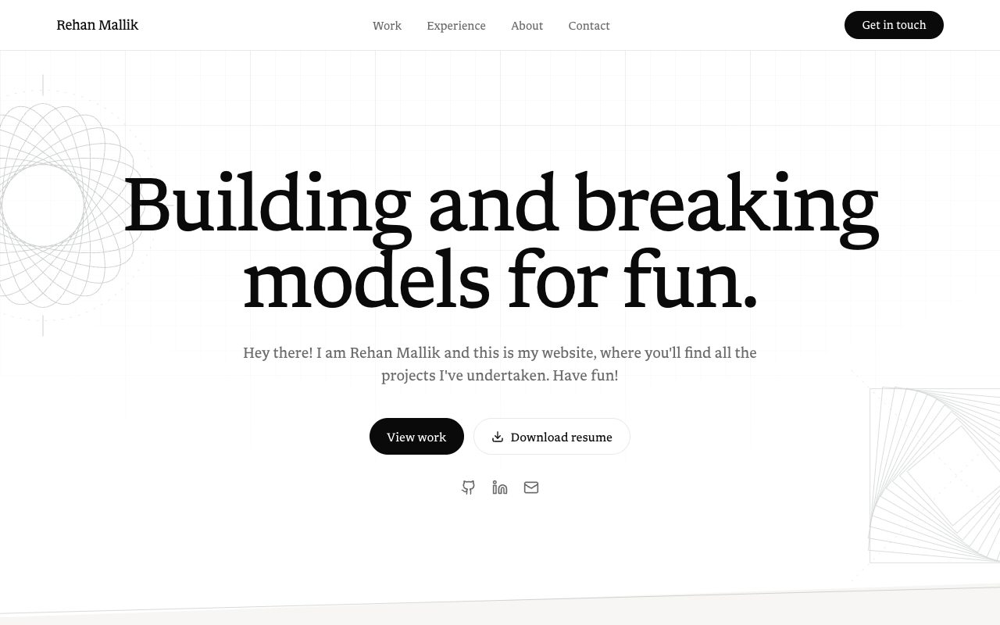
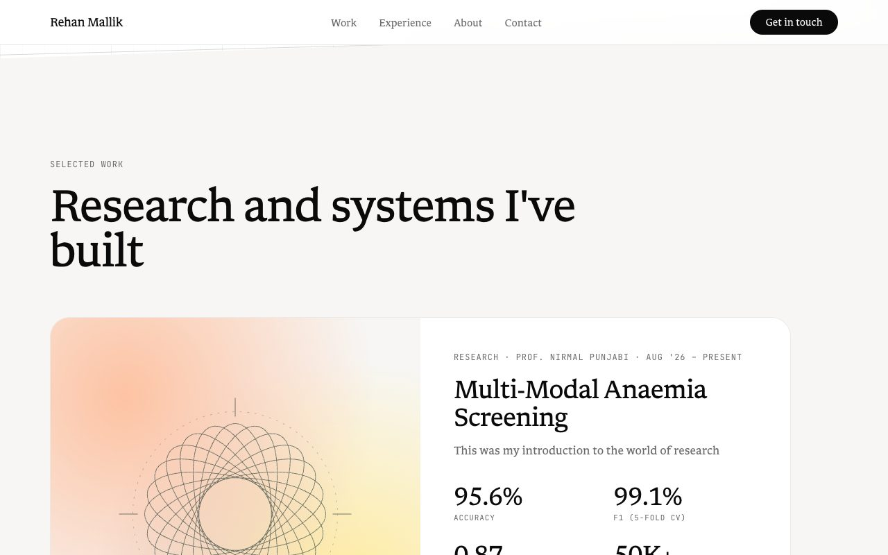

# Rehan Mallik · Portfolio

**Live site: [soemon007.github.io](https://soemon007.github.io)**

[](https://github.com/Soemon007/Soemon007.github.io/actions/workflows/publish.yml)

<p align="center">
  
  
</p>

This is the source code of my personal portfolio: a single page with my projects, experience and skills. It is
built to be fast, accessible and private, and to stay easy to change without breaking its design.

## Highlights

- **Fast.** On mobile, Lighthouse scores 97 or more for performance and 100 for accessibility, best practices
  and SEO. The whole page loads under half a megabyte of JavaScript and CSS, with self-hosted fonts and no
  render-blocking requests.
- **Private.** No cookies, no analytics, no tracking and no third-party requests: opening the site only ever
  contacts its own address.
- **Accessible.** Works with a keyboard, has a skip link, respects the "reduce motion" setting, and is readable
  even before JavaScript loads.
- **Considered motion.** Sections sweep in as you scroll, with a gentle, quick ease. Everything that moves has a
  reduced-motion fallback, and the finished page looks identical with or without it.
- **Hard to break.** All content lives in typed data files, and a suite of tests enforces the design rules (for
  example, no hard-coded colours and one-way imports). Every change is checked before it is published.

## Built with

| | |
| --- | --- |
| Framework | [TanStack Start](https://tanstack.com/start) on React 19 and TypeScript |
| Styling | Tailwind CSS 4 with a small set of design tokens |
| Tooling | Vite, ESLint, Prettier, Vitest and Testing Library, Bun |
| Hosting | GitHub Pages, from the `docs/` folder |
| Started in | [Lovable](https://lovable.dev) |

## How it is organised

```
src/data/        every word, link and number on the site, typed
src/components/  one file per page section, plus small reusable pieces
src/routes/      URLs only: kept deliberately thin
src/styles/      design tokens, utilities, motion, section layout
src/test/        tests that guard the content and the design rules
scripts/         static export and a verifier for the built site
guides/          architecture and design-system notes
docs/            the built website that GitHub Pages serves (generated)
```

Details, including how to add a project or a section, are in [guides/ARCHITECTURE.md](guides/ARCHITECTURE.md)
and [guides/DESIGN_SYSTEM.md](guides/DESIGN_SYSTEM.md).

## Run it locally

You need [Bun](https://bun.sh) and Node 22.

```sh
bun install
bun run dev        # local site with live reload
bun run check      # type check, lint, tests, build, and verification of the built site
```

## Quality checks and publishing

`bun run check` runs the type check, lint and tests, builds the static site into `docs/`, and then verifies the
result: every file the page references exists, every in-page link lands, nothing blocks the first paint, one
`h1`, search and sharing tags are present, and the size budget holds.

Pushing to `main` runs the same checks in GitHub Actions
([workflow](.github/workflows/publish.yml)). If they pass, the site is rebuilt and published to GitHub Pages; if
they fail, nothing is published and the live site stays as it was.

## Feedback

Issues are welcome for bugs, broken links, typos or accessibility problems. This is a personal site, so I don't
take pull requests that change its content or design. To report a security problem privately, see
[SECURITY.md](SECURITY.md).

## License and credits

The code and content of this site are © 2026 Rehan Mallik, all rights reserved. The repository is public so that
you can read it and learn from how it is built; please don't copy the text, project write-ups, images or overall
design to use as your own site. If you would like to reuse something, [get in touch](https://soemon007.github.io/#contact)
first.

Third-party material keeps its own licence:

- **Libron** typeface © Nico Verbruggen (derived from Newsreader and Readerly), SIL Open Font License 1.1:
  [public/fonts/LICENSE-Libron.txt](public/fonts/LICENSE-Libron.txt)
- **JetBrains Mono** typeface © The JetBrains Mono Project Authors, SIL Open Font License 1.1:
  [public/fonts/LICENSE-JetBrainsMono.txt](public/fonts/LICENSE-JetBrainsMono.txt)
- **Icons** from [Lucide](https://lucide.dev) (ISC).
- **UI primitives** in `src/components/ui` from [shadcn/ui](https://ui.shadcn.com) (MIT).
- The open-source libraries listed in `package.json`, each under its own licence.

[AGENTS.md](AGENTS.md) holds the project's conventions in a form that AI coding assistants and contributors can
read.
